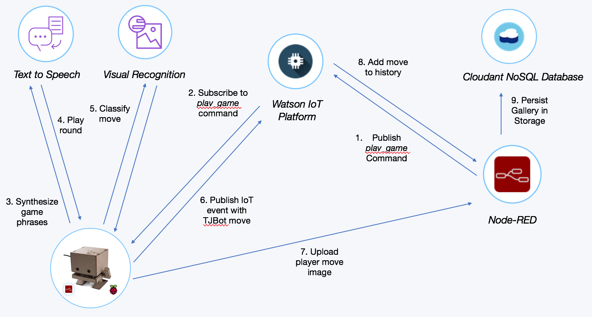
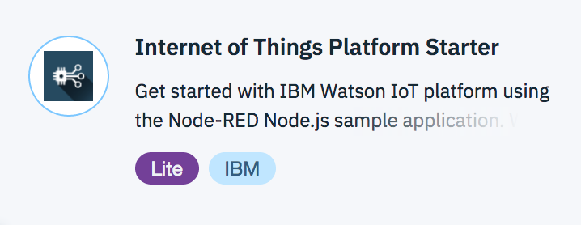
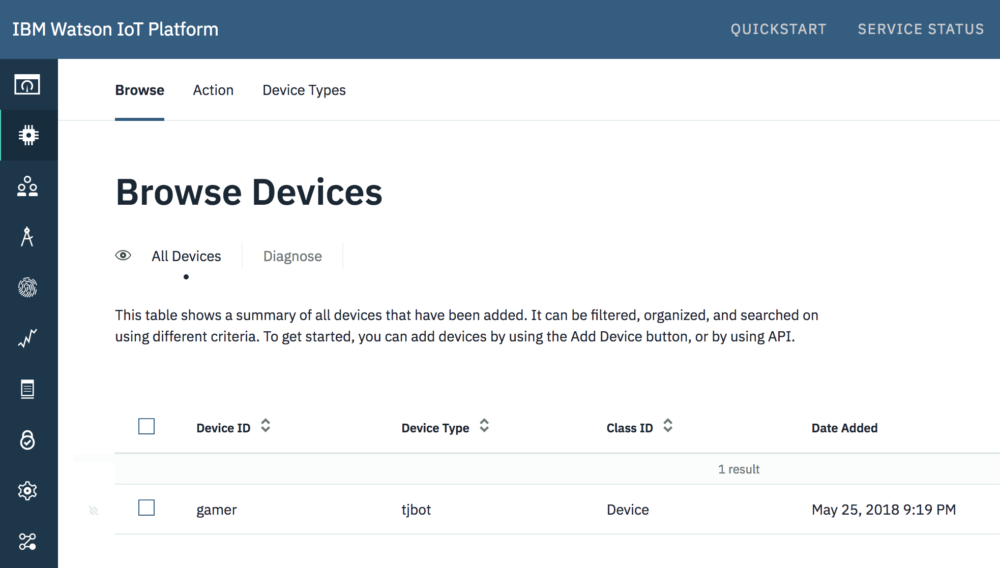
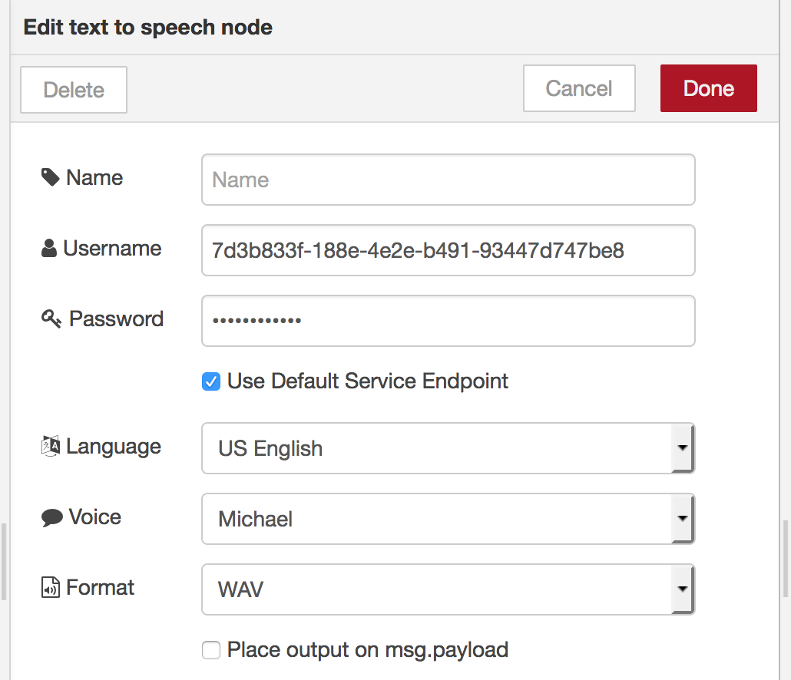
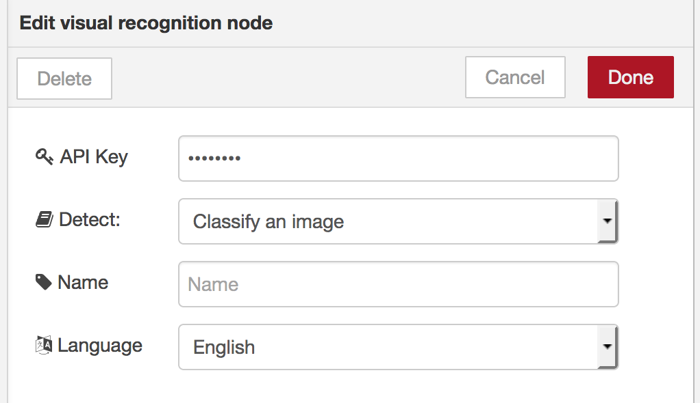
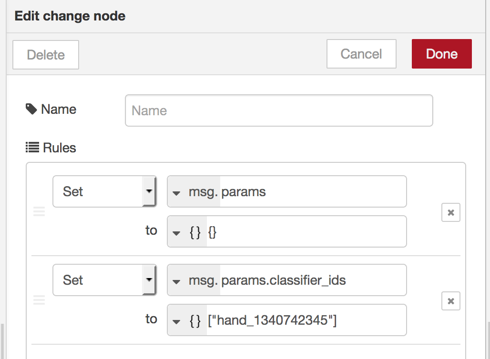
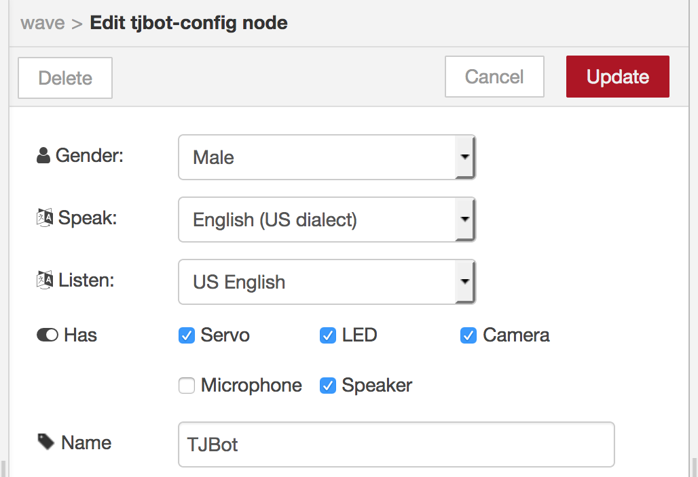
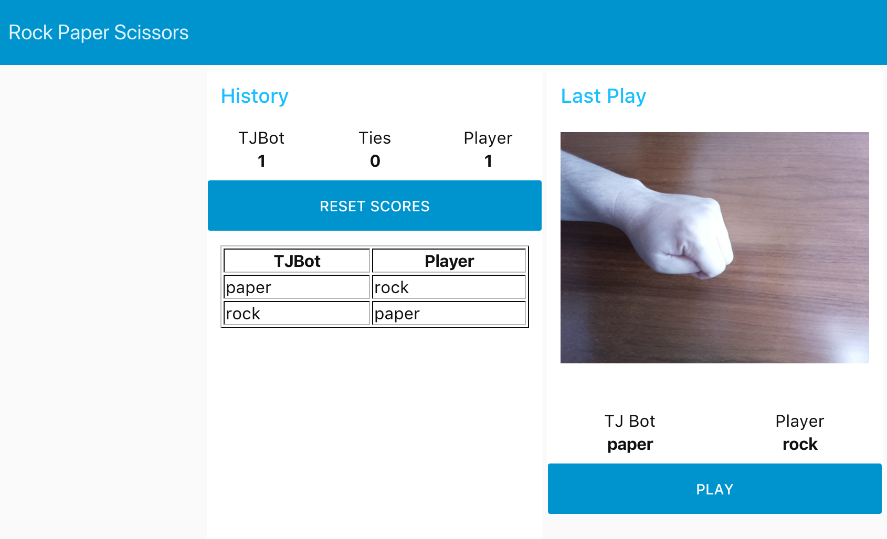

# Train TJBot to Play Rock Paper Scissors in Node-RED

In this tutorial, you'll train TJBot to play the game Rock Paper Scissors! Please refer to [this blog post](https://medium.com/@jeancarlbisson/train-tjbot-to-play-rock-paper-scissors-in-node-red-88698bddc389) for more information.

Back in grade school, one of the common games played on the playground was called Rock Paper Scissors. You could choose rock (a closed fist), paper (a flat hand), and scissors (a fist with the index and middle fingers extended, forming a V). The rules are simple: rock beats scissors, paper beats rock, and scissors beats paper. 

There are four components to this project. Node-RED running in the IBM Cloud, Node-RED running on the Raspberry Pi, the Watson Visual Recognition service, and the Watson IoT Platform service. 



## Training Watson Visual Recognition

The TJBot uses the Watson Visual Recognition service to classify the move in the image captured by the camera. The Watson service is trained with three sets of images: rock (closed hand), paper (flat hand), scissors (two fingers pointing, spread apart). It is recommended to have at least 50 images of each move, so ask your friends to give you a hand.

Create a new classifier in Watson Visual Recognition and upload the three zip files containing the images via the command line shown below. When trained, the service provides a classifier ID that can be used in the Node-RED application when calling the Watson Visual Recognition service.

```
curl -X POST -F "scissor_positive_examples=@scissor.zip" -F "rock_positive_examples=@rock.zip" -F "paper_positive_examples=@paper.zip" "https://gateway-a.watsonplatform.net/visual-recognition/api/v3/classifiers?api_key=API_KEY&version=2016-05-20"
```

## Node-RED in IBM Cloud

Create a Node-RED application in the IBM Cloud to display a scoreboard, show the picture taken, and add some controls that can be used during the game. The Node-RED flow is shown below.


Create an **Internet of Things Platform Starter** application available in the IBM Cloud catalog. This creates a Node-RED application, an Internet of Things Platform service and runs the front-end interface for the TJBot.



The front-end interface is created using the Node-RED dashboard nodes. Install the nodes by clicking the menu in the top right -> **Manage Palette** -> **Install** and search for *node-red-dashboard*. Click **install**.


In the Watson Internet of Things Platform service, I registered a device type of `tjbot`. Each of my TJBots has a unique ID. In this tutorial, I assigned it `gamer`. 



[Import this JSON](cloudflow.json) into Node-RED. Edit the *ibmiot* node and use the device type and device ID. When the user presses play on the interface, an IoT command is sent to the TJBot to play a game.


## Node-RED on Raspberry Pi

Keeping things in same language, I chose to use Node-RED on the Raspberry Pi running the TJBot. However, you can choose to subscribe to the IoT command in Python, Node.js, or another language and play the song that way.

If you haven't installed the TJBot Node-RED nodes on the TJBot, please refer to this [blog post for instructions](http://ibm.biz/train-tjbot-series) on how to do so. Import the [JSON flow](tjbotflow.json). Here's what the Node-RED flow looks like.


The TJBot performs most of the game play using the [Watson Text to Speech](https://ibm.biz/catalog-text-to-speech) and [Watson Visual Recognition](https://ibm.biz/catalog-visual-recognition) services.

There are a finite number of phrases for TJBot to speak in the game. Since there may be some latency in the internet connection, I chose to synthesize the phrases and store them locally on the device. 


Set the Watson Text to Speech service credentials in the Text to Speech node.



The TJBot uses the Watson Visual Recognition service to classify which move was made, captured via the camera. Set the Watson Visual Recognition service credentials in the Visual Recognition node.



In the change node before the Visual Recognition node, replace the classifier ID with the one created earlier when training a new custom classifier.



Double click on the Watson IoT input node and specify the IoT credentials for the TJBot to subscribe to the commands.


Double click on the speak node and set up the TJBot with a speaker, servo, LED, and camera.



Lastly, edit the http request node and set the application hostname to the IBM Cloud application. This will post the picture to the Node-RED dashboard to display on the scoreboard.


## Running the TJBot

Access the IBM Cloud application interface by opening the endpoint `/ui` of the Node-RED dashboard. Click Play to send a command to the TJBot. 

TJBot will explain the rules of the game and count down. When it counts down, show your move about 6 inches from the front of the TJBot. Unlike the real game, keep your move steady to avoid camera blur when the picture is taken. Don't worry, TJBot randomly makes the move, unrelated to the move of the player.



## License

This code is licensed under Apache 2.0. Full license text is available in [LICENSE](LICENSE).